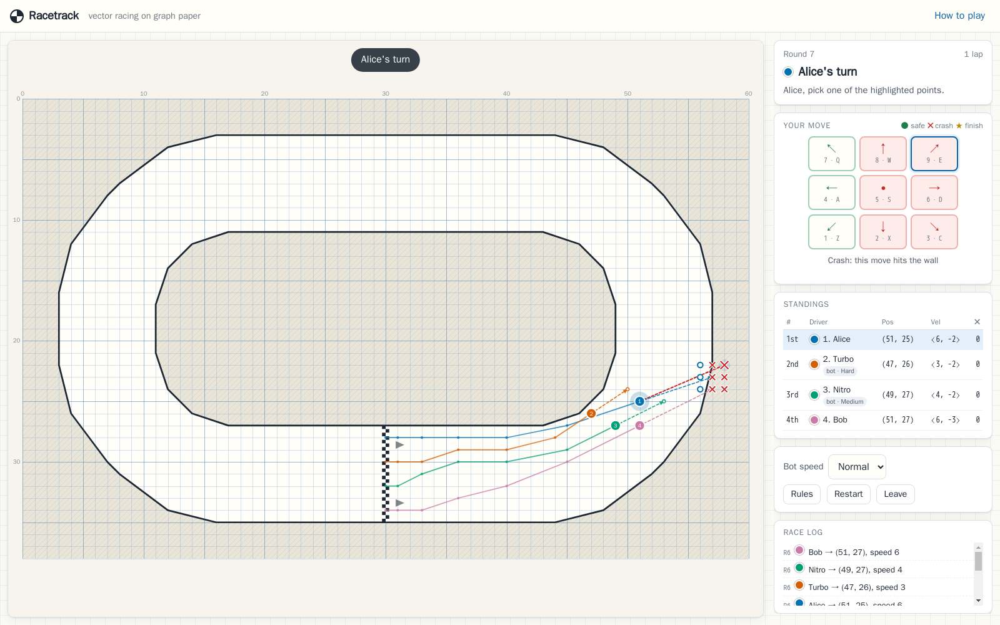

# Racetrack

The classic pen-and-paper vector racing game, in the browser. Every car sits on a
grid point and keeps its momentum: each turn you may only nudge your velocity by
one unit per axis — so the whole game is about planning your braking before the
bends.

- **Single player** against 1–3 bots (easy / medium / hard)
- **Local multiplayer** — up to 4 drivers taking turns on one screen, humans and bots in any mix
- **Online multiplayer** — rooms for 2–4 players with a server that runs the race, keeps every screen in sync, and copes with dropped connections
- **English, Español, Português and Italiano** — follows your browser's language, switchable at any time (even mid-race)



---

## Quick start (Docker)

Everything runs in containers; nothing is installed on your machine.

```bash
docker compose up -d --build
```

Open **http://localhost:8080** and pick a mode. That's it.

```bash
docker compose logs -f     # follow the server log
docker compose down        # stop
RACETRACK_PORT=9090 docker compose up -d --build   # use another host port
```

Without Compose:

```bash
docker build -t racetrack .
docker run --rm -p 8080:8080 racetrack
```

> The page must be served by the Racetrack server. Opening `src/client/index.html`
> straight from disk will not work (browsers refuse to load ES modules from `file://`,
> and online play needs the server anyway).

---

## How to play

1. **Grid and momentum.** Each car sits on a grid point and has a *velocity*: the
   step it made last turn, drawn as a dashed arrow.
2. **Your move.** Your car first repeats its last step (the end of the dashed
   arrow), then you may shift that end point by one grid step in any direction — or
   not at all. That gives the **9 points** shown on the board. The step you take
   becomes your new velocity. (In vector terms: acceleration `a ∈ {-1,0,1}²`,
   `v ← v + a`, `p ← p + v`.)
3. **Crashes.** A move whose straight path touches a wall (even a corner), leaves the
   track, or ends on another car is a **crash**: your turn ends, your car stays where
   it was, and its velocity drops to zero. Crash options are marked **✕**; the game
   asks you to pick one twice before it lets you crash on purpose. Cars may pass *over*
   each other — only the landing point counts.
4. **Winning.** The first car to cross the checkered line **in the direction of the
   arrows** — after the chosen number of laps — wins. With **Race ends: first to
   finish** (the default) the race ends right there; with **everyone finishes** the
   others keep going to decide the remaining places, and finished cars leave the track.
   Crossing the line backwards costs you a lap, so you can't cheat by reversing over it.
5. **Safety net.** If 200 rounds pass without a winner the race ends as a draw. With
   **everyone finishes**, hitting the limit after someone has won stops the race too:
   the winner keeps the win and the rest are ranked by the distance they had left.

Cars start on the start/finish line in seat order, and seat 1 moves first.

### Controls

| Action | Mouse / touch | Keyboard |
| --- | --- | --- |
| Choose one of the 9 points | click / tap the point on the board, or a move-pad button | numpad `7 8 9 / 4 5 6 / 1 2 3`, the same digits on the top row, or `Q W E / A S D / Z X C` |
| Keep your current velocity | the centre point | `5` or `S` |
| Confirm a crashing move | pick the same point again | press the same key again |
| Cancel a pending crash | pick another point | `Esc` |

Hovering an option previews the path and tells you whether it is safe, crashes
(and why), or finishes the race. On touch screens (and on very small boards) a tap
on the board first *selects* a point — tap it again to confirm — so a finger can't
pick the neighbouring point by accident; the move pad always works with one tap.
Holding a key down never makes more than one move.

### What's on screen

- **Board:** graph paper, walls (thick lines), off-track area (hatched), the
  checkered start/finish line with direction arrows, every car (numbered by seat),
  its trail, its velocity arrow, and — on your turn — your nine options.
- **Side panel:** whose turn it is (plus a banner in hot-seat games so you know when
  to swap), the move pad, live standings with each car's position `(x, y)`,
  velocity `⟨vx, vy⟩` and crash count, a race log, and in online games the turn
  timer and connection status.

### Language

The game is available in **English, Español, Português (Brazil) and Italiano**. It
starts in your browser's preferred language (English if none of these match); switch
with the menu in the header at any moment — the race carries on, and the board, side
panel and race log switch over at once. The choice is remembered on that device.

A link can pick the language with `?lang=` (`en`, `es`, `pt`, `it`), e.g.
`http://<server>/?lang=it`, also together with an invite: `/?room=K7QXP&lang=es`.
In online games everyone sees the race in their own language.

---

## Game modes

### Single player
Choose 1–3 opponents, their difficulty, the number of laps and when the race ends
(first to finish, or once everyone has finished). You drive seat 1.

### Local multiplayer (hot seat)
Configure up to four seats as **Human**, **Bot** (with its own difficulty) or
**Empty** — at least two drivers. Players take turns on the same screen in seat
order; a banner announces whose turn it is. The **Bot speed** selector in the side
panel speeds up or slows down bot turns (handy for all-bot races).

### Online multiplayer
1. **Online multiplayer → Create a room.** You become the host and get a five-character
   room code plus an invite link (`http://<server>/?room=CODE`).
2. Friends open the link (or enter the code) and join. The host can add bots, remove
   players, and change laps / race end / turn timer.
3. The host starts the race (2–4 drivers). The server runs the race: every move is
   validated against the same rules engine and broadcast to everyone.

Robustness built in:

| Situation | What happens |
| --- | --- |
| A player reloads the page | They rejoin the same seat automatically (session stored per tab). |
| A connection drops | The client keeps reconnecting (exponential backoff, capped at 8 s, never giving up) and reclaims its seat. A player who dropped has 30 s to come back; if their turn comes after that, an **autopilot** drives their car until they return. |
| Turn timer (optional: 30 s / 60 s / 2 min) | If it runs out, the autopilot makes that one move. Reconnecting or reopening the game elsewhere doesn't restart your clock. |
| A player leaves mid-race | Their car is retired and their turns are skipped. Leaving while offline is delivered as soon as the connection is back. |
| The host leaves | Another human becomes host. |
| Nobody is connected | The race pauses; the room is closed after 5 minutes. |
| Double clicks / stale moves | Every move names the turn it was made for; duplicates are rejected. |
| The server restarts | Clients are told the room closed and return to the online menu. |

---

## The bots

Bots plan a few moves ahead over (position, velocity) states:

1. A **distance field** (Dijkstra over the grid, from the finish line backwards around
   the track) gives every grid point its "distance to go".
2. For each of the nine moves, the bot searches all crash-free follow-up sequences up
   to its horizon and scores each plan by the distance still to go at its end (plus a
   small bonus for momentum).
3. A plan must end in a **safe state** — one from which the car can still brake to a
   standstill without touching a wall — so bots don't carry too much speed into bends
   they can't see yet.
4. Winning moves are taken immediately; moves onto another car count as crashes.

In traffic, medium and hard bots keep their next move off squares that rival cars
occupy or are heading to, and medium bots also avoid plans that leave only one safe
way out (another car parked on it would force a crash).

| Level | Look-ahead | Style | Solo lap of the oval |
| --- | --- | --- | --- |
| Easy | 2 turns | noisy, occasional blunders | ~36 turns, the odd crash |
| Medium | 2 turns | somewhat noisy, keeps an escape route | ~31 turns |
| Hard | 6 turns | deterministic | ~29 turns |

For reference, the fastest possible lap is 27 turns — using one deliberate crash to
kill speed instantly (28 without); bots never crash on purpose. A decision usually
takes a few milliseconds.

---

## Tests

```bash
docker compose run --rm --build test
```

runs the full unit + integration suite (~300 tests, ~20 s) inside a container:

| Area | What is covered (file) |
| --- | --- |
| Geometry | exact segment intersection incl. touching/collinear/degenerate cases, point-in-polygon, polygon validation (`test/geometry.test.js`) |
| Track | surface classification, wall collision incl. grazing corners and jumping over the island, finish-line crossing in both directions, track-definition validation (`test/track.test.js`) |
| Movement & rules | the 9 options, velocity/position updates, turn order and rounds, invalid input, wall and car collisions, winning, backwards crossings, multi-lap races, round limit, retiring, immutability (`test/game.test.js`) |
| Bots | distance field, never crashing when a safe move exists (property test over random states), taking wins, avoiding cars, finishing laps, hard beats easy, determinism (`test/bot.test.js`) |
| Protocol | message validation, room codes, settings, name sanitising (`test/protocol.test.js`) |
| Server coordination | rooms, host rules, turn enforcement, stale/duplicate moves, bots, turn timers (which reconnecting can't extend), disconnect → grace → autopilot → resume, session takeover, leaving, pausing, room cleanup, flood handling, per-address room limits (`test/roomManager.test.js`) |
| Real server | HTTP + security headers (incl. the WebSocket CSP), static-file safety (path traversal, no descriptor leaks on aborted downloads), health check, per-address connection limits, full races over real WebSockets with state compared on every move, dropped connections, oversized frames, graceful shutdown even with stalled peers (`test/server.integration.test.js`) |
| Client | hot-seat controller, reconnecting WebSocket client, online session (resume, leaving while offline, cancelled requests, errors, timeouts), online game controller (incl. rematches missed while offline), formatting, viewport maths (`test/client/*.test.js`) |
| Translations | every language has all the English messages (with its own plural forms) and the same `{placeholders}`, only whitelisted markup, a message for every server/engine/client error code; every key the page and the code use exists and every key is used; plural rules, fallbacks, browser-language matching, ordinals, game text in each language (`test/client/i18n.test.js`) |

### End-to-end browser tests

```bash
docker compose --profile e2e run --rm --build e2e
docker compose --profile e2e down
```

This drives a real headless Chromium (the `zenika/alpine-chrome` image) through all
three modes — a full single-player race to the finish, a hot-seat game using keyboard,
canvas clicks, crash confirmation and a held-down key, an online game in two isolated
browser sessions (including a page reload mid-race and a player leaving), the
languages (detection from the browser, `?lang=`, switching mid-race with the log
rewritten, translated server errors, no untranslated text or raw keys on screen), and
phone layouts in portrait and landscape, in every language — and fails on any error in
the browser console. Screenshots land in `./test-results/`.

---

## Running an online server

The same container serves the game and coordinates online races — there is nothing
else to set up.

**On your LAN:** start it as above and have friends open `http://<your-ip>:8080`
(allow the port through your firewall).

**On the internet:** put it behind a reverse proxy that terminates TLS and passes
WebSocket upgrades through; the client automatically uses `wss://` when the page is
served over HTTPS. Set `TRUST_PROXY=true` so per-address limits use the real client
address from `X-Forwarded-For` (only do this behind a proxy you control, since the
header is otherwise trivial to forge). For example, with Caddy:

```caddyfile
racetrack.example.com {
    reverse_proxy localhost:8080
}
```

or nginx:

```nginx
location / {
    proxy_pass http://127.0.0.1:8080;
    proxy_http_version 1.1;
    proxy_set_header Upgrade $http_upgrade;
    proxy_set_header Connection "upgrade";
    proxy_set_header Host $host;
    proxy_read_timeout 120s;
}
```

### Configuration (environment variables)

| Variable | Default | Meaning |
| --- | --- | --- |
| `PORT` | `8080` | Port inside the container / process. (Compose: set `RACETRACK_PORT` for the host port.) |
| `HOST` | `0.0.0.0` | Interface to bind. |
| `LOG_LEVEL` | `info` | `debug`, `info`, `warn`, `error` or `silent`. |
| `LOG_FORMAT` | `text` | `text` or `json` (one JSON object per line). |
| `BOT_MOVE_DELAY_MS` | `700` | Pause before bots / the autopilot move online, so humans can follow. |
| `RECONNECT_GRACE_MS` | `30000` | How long the race waits for a disconnected player before the autopilot takes over. |
| `MAX_ROOMS` | `500` | Room limit. |
| `MAX_ROOMS_PER_IP` | `10` | Open rooms one client address may have created at once. |
| `MAX_CONNECTIONS` | `2000` | WebSocket connection limit. |
| `MAX_CONNECTIONS_PER_IP` | `30` | Concurrent WebSocket connections per client address. |
| `TRUST_PROXY` | `false` | Take the client address from `X-Forwarded-For` (behind a reverse proxy). |
| `HEARTBEAT_INTERVAL_MS` | `15000` | Ping interval used to detect dead connections. |
| `ALLOWED_ORIGINS` | *(any)* | Comma-separated list of allowed `Origin`s for WebSocket connections, e.g. `https://racetrack.example.com`. |

Invalid values stop the server at start-up with a clear message.

`GET /healthz` returns `{"status":"ok","uptimeSeconds":…,"rooms":…,"connections":…}`
and is used by the container health check.

**Operational notes.** Rooms live in memory: restarting the server ends running
games (players are told their room closed). A single instance comfortably serves
many small rooms; it is not designed to be load-balanced across several instances.
Abuse protection: messages are size-limited and rate-limited per connection (floods
are disconnected), rooms and connections are capped per client address, peers that
stop reading or answering are cut off, names are sanitised, and pages are served with
a strict Content-Security-Policy that only allows WebSockets back to the same host.

---

## Project structure

```
src/
  shared/                 Pure game logic — runs unchanged in the browser, the server and tests
    game.js               Rules engine: state, 9 options, moves, crashes, turns, winning
    track.js              Track model: surface, exact wall collision, finish-line crossing
    geometry.js           Exact integer geometry predicates
    distanceField.js      "Distance to go" field (bots, standings)
    bot.js                Bot AI
    standings.js          Live race order
    protocol.js           Online message types, validation, error codes
    tracks/               Track definitions (oval.js) + registry (index.js)
    constants.js, errors.js, rng.js, validation.js, vec.js
  server/
    index.js              Entry point (config, logging, signals)
    app.js                HTTP server: static files, security headers, /healthz
    wsGateway.js          WebSocket transport: connections, heartbeats, limits
    roomManager.js        Rooms, lobby, turn coordination, bots, reconnection, timers
    staticFiles.js, config.js, logger.js
  client/
    index.html, css/style.css
    js/main.js            Screen routing and controller lifecycle
    js/gameView.js        Race screen: canvas + HUD + input + animations
    js/renderer.js        Canvas drawing
    js/localController.js Single-player / hot-seat game loop
    js/online.js          Online session + online game controller
    js/connection.js      Reconnecting WebSocket client
    js/i18n.js            Translations: t() / tn(), language choice, page text
    js/locales/           Message catalogs: en.js (reference), es.js, pt.js, it.js
    js/setup.js, lobby.js, dom.js, format.js, storage.js, viewport.js
test/                     node:test suites (+ helpers/, client/, e2e/)
docs/                     ARCHITECTURE.md, PROTOCOL.md
Dockerfile, docker-compose.yml
```

See [docs/ARCHITECTURE.md](docs/ARCHITECTURE.md) for how the pieces fit together and
[docs/PROTOCOL.md](docs/PROTOCOL.md) for the WebSocket protocol.

### Adding a track

Tracks are plain data. Create `src/shared/tracks/<name>.js` exporting a definition
like `oval.js` — grid size, wall polygons (integer vertices; the drivable surface is
inside an odd number of polygons), a finish line that spans the track from wall to
wall and crosses it exactly once, the racing direction, and at least four start
positions on or just past the line — then add it to `DEFINITIONS` in
`src/shared/tracks/index.js`. Definitions are validated when the registry loads (and
by the test suite): besides the geometry, the validator checks that the finish can be
reached and that every start position really is at the beginning of a lap. New tracks
appear in every track selector automatically, and the bots work on any valid track.
To give a track a translated name, add `track.<id>.name` to the message catalogs.

### Adding a language

1. Copy `src/client/js/locales/en.js` to `src/client/js/locales/<code>.js` (a
   two-letter code such as `fr`) and translate the messages. Keep every key and every
   `{placeholder}`. Messages with plural forms (`game.laps.one` / `.other`, …) follow
   the language's own rules via `Intl.PluralRules`: add the forms it needs (e.g.
   `.few` and `.many` for Polish) and leave out the ones it doesn't use; `.zero` is
   an optional special case. Keys ending in `Html` may contain `<strong>`, `<em>`,
   `<kbd>` and `<span class="legend-crash">`, nothing else.
2. Register it in `src/client/js/i18n.js`: import the catalog, add it to `CATALOGS`,
   and add `{ code, name }` to `LANGUAGES` — the name written in that language, as the
   language menu shows it.
3. Optionally teach `formatOrdinal()` in the same file how the language writes "1st,
   2nd" (standings show plain numbers otherwise).
4. Run the tests. `test/client/i18n.test.js` names every missing or unknown key,
   mismatched placeholder, empty message and disallowed tag.

Browsers asking for the new language get it automatically, and it appears in the
language menu. The server needs no changes: it only ever sends error codes and data,
which each browser puts into words.

---

## Development without Docker (optional)

With Node.js 22 or newer installed locally:

```bash
npm ci
npm start          # http://localhost:8080
npm test
npm run dev        # restarts the server when files change
```

## Troubleshooting

- **"Port is already in use"** — another program has port 8080; use
  `RACETRACK_PORT=9090 docker compose up -d --build` (or `PORT=9090 npm start`).
- **Online menu says "reconnecting…" forever** — the page must come from the Racetrack
  server itself; behind a proxy, make sure WebSocket upgrades on `/ws` are forwarded.
  The client keeps retrying and reconnects on its own once the server is reachable.
- **"The server was updated. Please reload the page."** — the page is older than the
  server; reload it.
- **Nothing happens when I press a key** — keys only drive the car on your turn and
  when no text field or dialog has focus.
- **"Too many rooms are open from your network"** — close some rooms, raise
  `MAX_ROOMS_PER_IP`, or (behind a reverse proxy) set `TRUST_PROXY=true` so players
  aren't all counted as the proxy's address.
